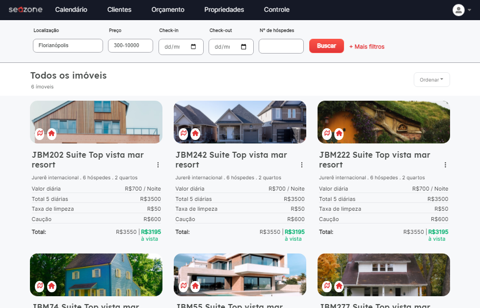
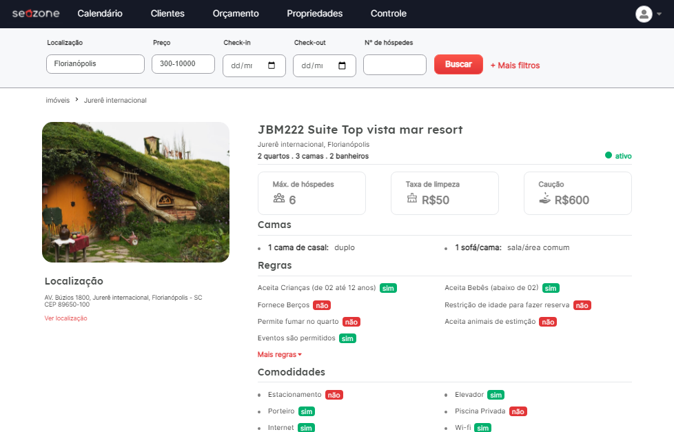

# Seazone challenger

<p align="center">
  <a href="#-tecnologias">Techs</a>&nbsp;&nbsp;&nbsp;|&nbsp;&nbsp;&nbsp;
  <a href="#-project">Project</a>&nbsp;&nbsp;&nbsp;|&nbsp;&nbsp;&nbsp;
  <a href="#memo-licence">licence</a>
</p>

<p align="center">
 

  
</p>

<br>

Properties page

<p align="center">
  
</p>

Property page

<p align="center">
  
</p>

## 🚀 Techs

This project were build by these technologies:

- [x] TypeScript
- [x] ReactJS
- [x] [Next.js](https://nextjs.org/docs)

### Dependencies

- [x] Yarn
- [x] Axios
- [x] JSON-Server
- [x] SASS

### Features

- [x] Fake API
- [x] Perfomatic
- [ ] Response

## 💻 Project

This challenge were made more to show my skills as a programmer.

### Requirements

- You need to install both [Node.js](https://nodejs.org/en/download/) and [Yarn](https://yarnpkg.com/) to run this project.

**Clone the project and access the folder**

```bash
$ git clone https://github.com/Thiago-spart/seazone-challenger.git
```

```bash
$ cd seazone-challenger
```

**Follow the steps below**

```bash
# Install the dependencies
$ yarn

# Run the backend fake server
$ yarn server

# Run the web server
$ yarn dev
```

## :memo: License

This project is licensed by the MIT license. Check it out in [LICENSE](./LICENSE.md) for more details.
